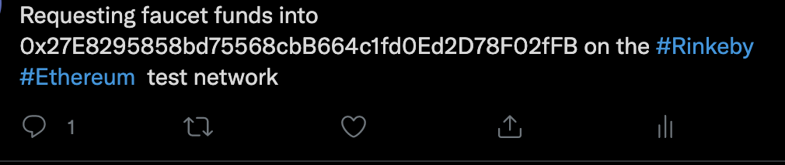
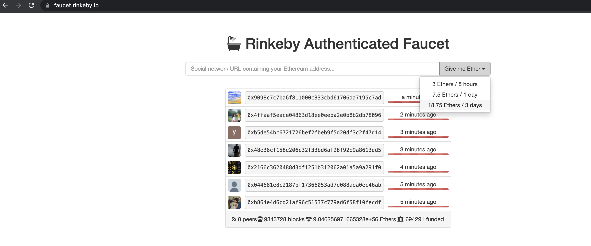
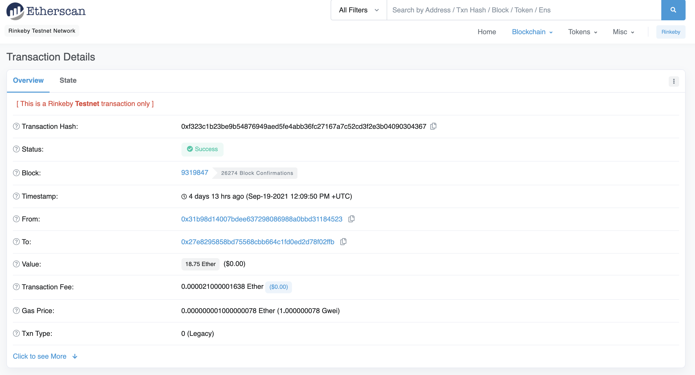
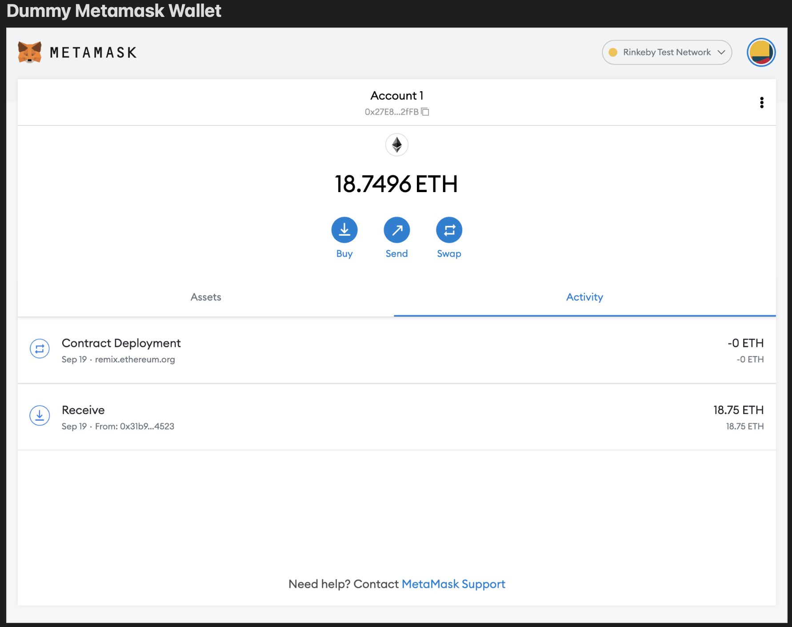
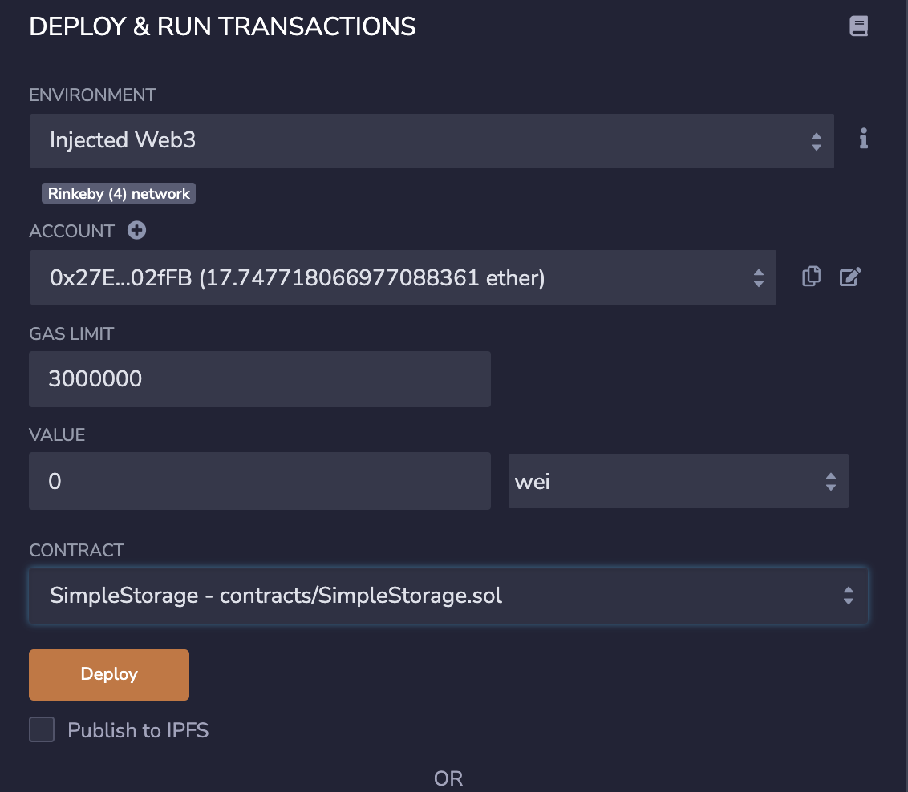
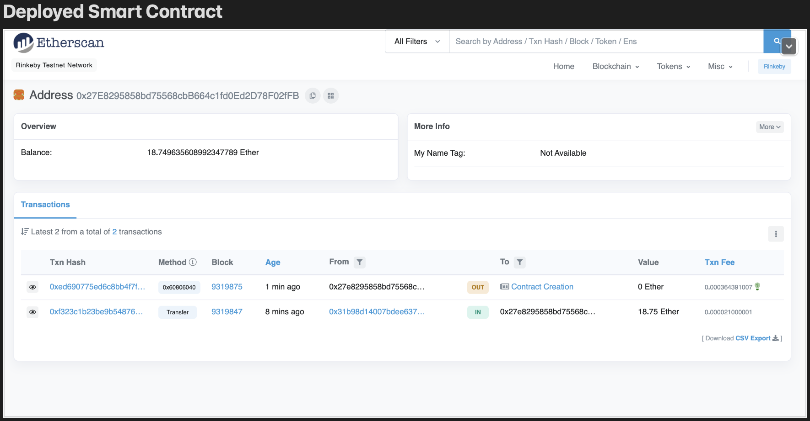
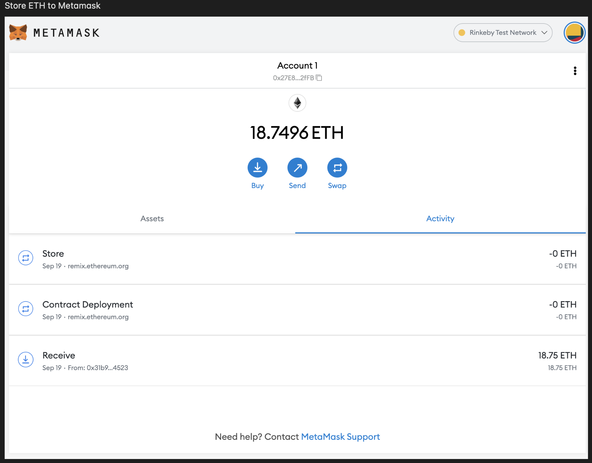

# contract-creation

This code will help you to create a simple storage and deploy your ethereum contract. 

Here are the steps:
1) Fund your wallet. On my end I used Metamask and fund my wallet by ff  these steps:

2) Go to [Rinkeby] (https://faucet.rinkeby.io/) and fund your wallet and paste the URL posted in your social networking site.

You are now funded!

3) Once funded let's then deployed your smart contract in Rinkeby faucet by clicking Deploy button in Remix

Good one! You have your first own smart contract.
